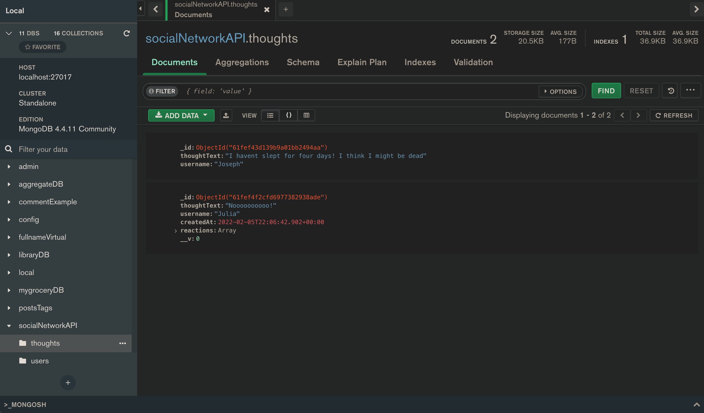
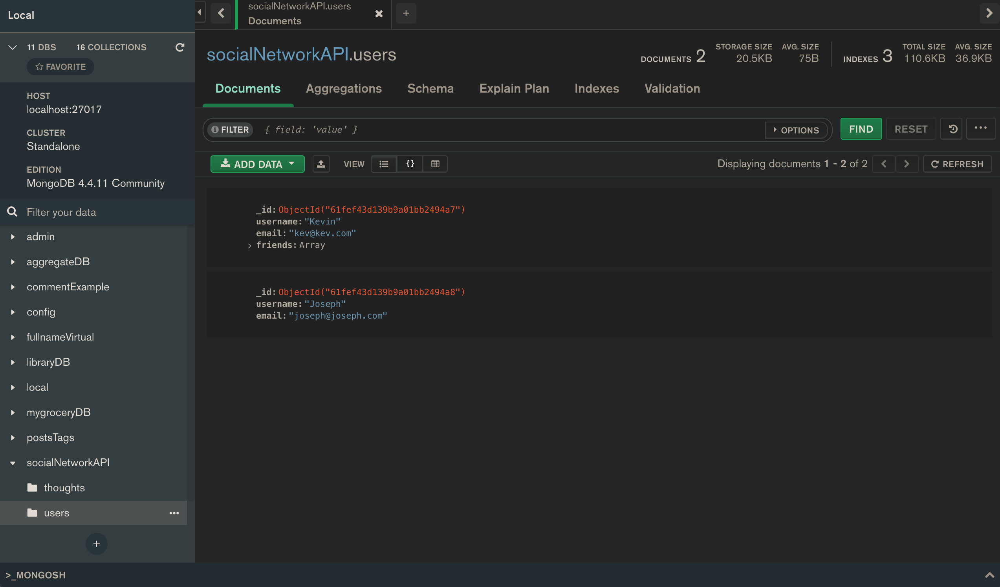

<a href = "title"></a>

# Social Network API

<a href = "tableOfContents"></a>

## Table of Contents

- [Title](#title)
- [Table of Contents](#tableOfContents)
- [User Story](#userStory)
- [Descripton](#description)
- [Video](#video)
- [Technology Used](#tech)

<a href = "userStory"></a>

## User Story

```md
AS A social media startup
I WANT an API for my social network that uses a NoSQL database
SO THAT my website can handle large amounts of unstructured data
```

## Acceptance Criteria

```md
GIVEN a social network API
WHEN I enter the command to invoke the application
THEN my server is started and the Mongoose models are synced to the MongoDB database
WHEN I open API GET routes in Insomnia for users and thoughts
THEN the data for each of these routes is displayed in a formatted JSON
WHEN I test API POST, PUT, and DELETE routes in Insomnia
THEN I am able to successfully create, update, and delete users and thoughts in my database
WHEN I test API POST and DELETE routes in Insomnia
THEN I am able to successfully create and delete reactions to thoughts and add and remove friends to a user’s friend list
```

<a href = "description"></a>

## Description

For this project we were required to build a backend of a social media website comprised with users, thoughts, and reactions. Below you will find a link to a demo video, images of our database on MongoDB Compass, and a list of technology used. 

When installing, clone this repository and run:
```
npm install -y
```

After that is done you will want to run the seeds files:
```
node utils/seeds.js
```

Then to turn on the program run:
```
npm start
```

<a href = "video"></a>

## Video

[Video Link](https://watch.screencastify.com/v/Q1kRFoPD79kPXD3sIgub)

<a href = "images"></a>

## Images





<a href = "tech"></a>

## Technology Used

- MongoDB
- Mongoose
- NodeJS
- Express
- Insomnia

<a href = "contact"></a>

## Contact

If you would like to contribute to this code and develop it further please feel free! 

[GitHub](https://github.com/joecliffordofficial)